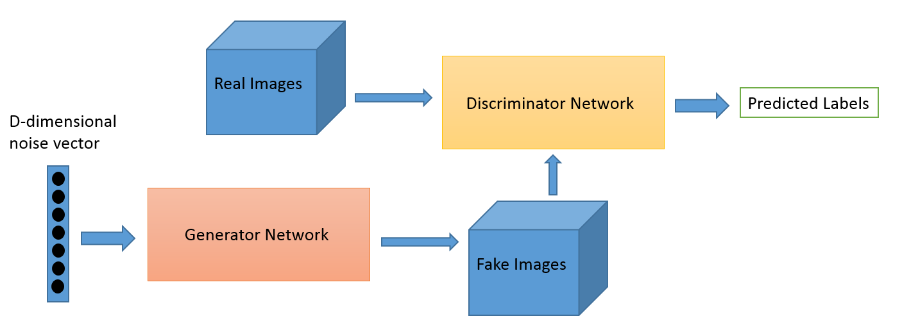
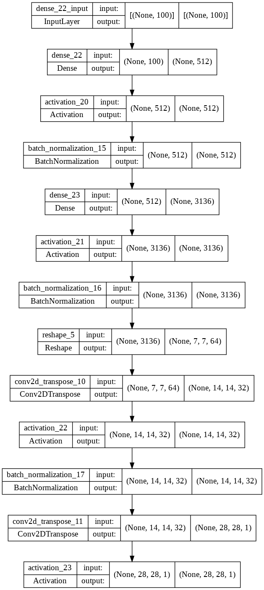
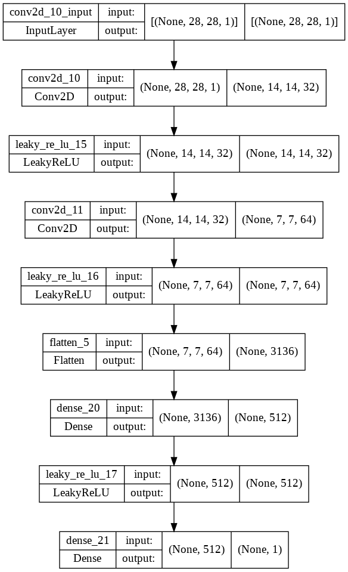
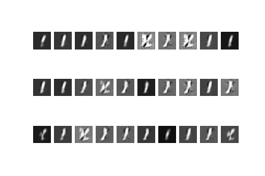
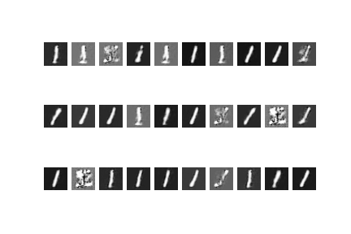
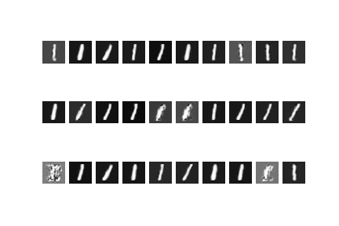
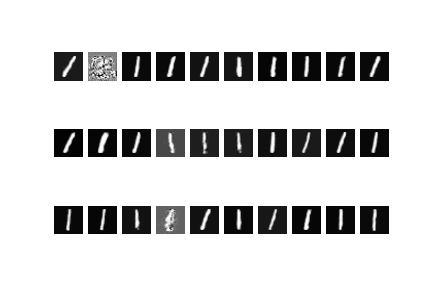

# Training a GAN

Using the MNIST digits dataset try to generate  GAN that allow use to generate synthetic data and test them against.

I would try to train a gGAN with the MNIST dataset to be able to generate MNIST Synthetic data from the model.

First a brief explanation of GAN

## GAN

Generative adversarial networks

1.  The generator network takes in random numbers and returns an image.
2. This generated image is fed into the discriminator alongside a stream of images taken from the real dataset.
3. The discriminator takes in real and fake images.
4. The dicriminator networlk will return probabilities. 1 meaning authentic and 0 fake.

With this strcuture we can train the GAN

In the file **models.py** we have three models defined.

1. Generator Model

	This model will generate the fake images from a flat noise input that we have decidet to have 100 features.
	
	It is a full connected network with 512 , with a second fullconected 3136 (7*7*64) and two 2-D Transpose convolutional layers (Deconvolutional). 

2. Discriminator Model

	Two Convolutional 2D layers with a final dDense with 512 and a Sigmoid Layer at the end.

3. GAN Model

	The former two of them in a sequential form with the discrimination model part not trainable.

## Implementation

There are two files with two implementations the frst one that uses all the MNIST and the second one that generate the models for every digit individually.

### MNIST as a whole
The results for using the whole MNIST as input and the  file main.py are here. It is possible to see that from the white noise we are evolving to the sythetic data. It is still a little blur but it is converging.

### MNIST Digit by Digit

On the other hand, making ten diferent models, one per digit. We can see that the convergence is faster we can see that even from the 500th iteration the zero reassembles to one.

Start

500th Iteration

1500th Iteration

2500th Iteration

5000th Iteration

 
With more training the models will converge.

It is possible to see that is is possible to generate Synthetic Data of the MNIST set with a GAN network.

I supose the second option, althoug havin to train ten models will be a better option because we can generate the number of data we need to keep it ba;anced in case we use them to train an unbalanced model. 

	